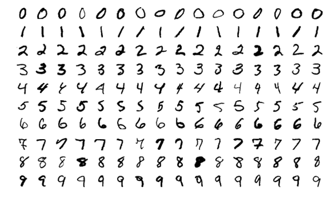

# Kernel Perceptron for MNIST Digit Classification

This repository contains the implementation of the Kernel Perceptron algorithm for digit classification using the MNIST dataset. The project explores binary and multiclass classification tasks, evaluates model performance, and analyzes the effects of hyperparameter tuning on prediction accuracy.

## Project Structure

- **`MatteoCiarrocchi_MLProject_Analysis.ipynb`**: The Jupyter notebook containing the implementation of the Kernel Perceptron algorithm and analysis.
- **`MatteoCiarrocchi_MLProject_Report.pdf`**: The report summarizing the methodology, experiments, and key findings.

## Key Objectives

1. Develop a Kernel Perceptron algorithm for binary classification of digits (0-9).
2. Extend the binary classifiers to multiclass predictors using the "One vs. All" approach.
3. Tune hyperparameters to optimize classification performance.

## Methodology

### Dataset
- **MNIST Dataset**:
  - Training set: 8,000 samples.
  - Test set: 2,000 samples.
  - Each digit is represented as a vector of 784 pixel features.

### Kernel Perceptron Algorithm
1. **Binary Classification**:
   - Implemented for each digit using polynomial kernel expansions of varying degrees.
   - Explored empirical risk minimizer (ERM), average, and weighted average predictors.

2. **Hyperparameter Tuning**:
   - Grid search for the number of epochs and polynomial kernel degrees.
   - Evaluated using validation set and 5-fold cross-validation.

3. **Multiclass Classification**:
   - Combined binary classifiers for multiclass predictions.
   - Compared individually tuned classifiers with shared-parameter classifiers.

## Results

1. **Binary Classifiers**:
   - Training accuracy: 98.20% - 99.80%.
   - Test accuracy: Improved with weighted predictors and hyperparameter tuning.

2. **Multiclass Classifiers**:
   - Best accuracy: 95.25% (achieved using shared hyperparameters).

3. **Hyperparameter Insights**:
   - Polynomial degree plays a critical role in learning speed and generalization.
   - Overfitting was mitigated using cross-validation.
